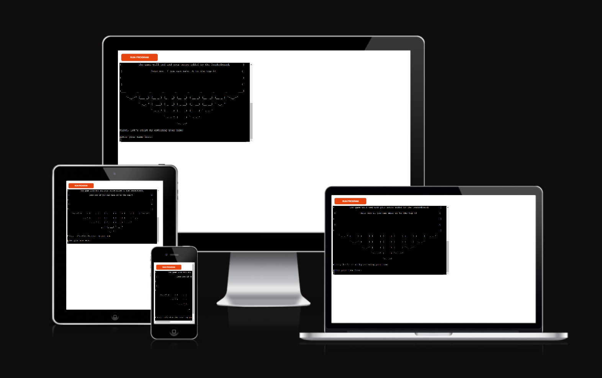
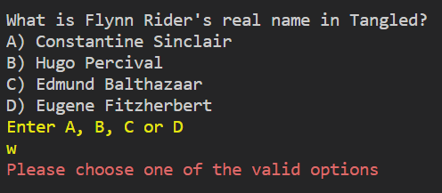
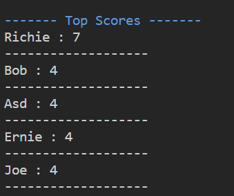

# Disney Trivia
Disney Trivia is a simple game of Trivia designed to test the users knowledge on Disney Movies and TV shows. The user will be asked a series of Disney related questions where they will have several answers to choose from. Once the user has answered all questions the game will end and add their scores to the leaderboard. Only the top 5 scores will be displayed in the leaderboard however to add a competitive edge.

The live link can be found here - [Disney Trivia](https://disney-trivia-5fe4c14fdc49.herokuapp.com/)

## How to Play
- Users will enter a name for themselves
- Users will answer the questions display one after the other
- Users score is saved to a linked spreadsheet
- A leaderboard of the top 5 scores is displayed

## Site Owner Goals
- To provide the user with a simple game that is both challenging and rewarding.
- To present the user with an app that functions well and is easy to use. 
- To entice the user to return to the game to improve their score.

## User Stories

- ### As a user I want to:
  - Understand the main purpose of the game.
  - To flow from question to question without interruption.
  - See my score at the end of the game
  - Compare my score to others on the leaderboard.
  - Try and beat my score on the leaderboard
  - Get new questions each time I play.

## Logic Flow
In order to visualise the flow of steps required in the game, I created a flow chart using Lucid Chart. It was beneficial for me to plan the project like this as it allowed me to gain an understanding of what functions were required for the game and at what stages and how the different elements of the game would interact.

As the flow chart was created at the outset of the project, it does not fully reflect all elements of the game.

## Features

### Title and Introduction Section
- When the user loads the site they will be presented with a welcome banner and instructions on how to play the game
- The welcome text was created using Pyfiglet which takes ASCII text and renders it into ASCII art fonts. The how to play banner was also taken from the ASCII art website 

- There is strong data validation on the username input. The user must enter a username consisting of letters only and must be 3 letters or more in lenght. They cannot just enter a blank space or other values. If they do not enter valid data, an error message will appear in red saying "Sorry, you must enter a name 3 letters long and only use letters, try again." and they will be asked to input their name again.

### The Game Loop
- When the user enters their name the computer will welcome them to the game and repeat their name back to them, the name will also now be capitalized using the inbulit capitalize() function. 
- From here the game will start

- It doesn't matter if their input is lower or upper case. The computer can handle both inputs by using the inbuilt function, lower().
- If the user puts in anything other than 'a', 'b', 'c' or 'd', an error will print saying "Please choose one of the valid options" in red.
- Once the user enters the valid option, the next question presents.

### Game Over Menu
- When the user completes the final question, the game ends a "game over" is printed
- The user name and their final score is also printed 
- The user is told they can then restart the game by running the function once more

### Leaderboard
- The Leaderboard feature was created using Google Sheets. The spreadsheet is accessed by the game through the Google Drive and Google Sheets APIs on the Google Cloud Platform.

- Credentials were generated and provided to allow access from the project to Google Sheets. These were added to the cred.json in the .gitignore file to ensure they weren't pushed to my Github repository. They also had to be added to the Config Vars on Heroku to ensure they could be accessed when running the game. 
- The Leaderboard displays the top 5 scores. The scores are sorted using the inbulit sorted funtion with Lambda where the score colum is accessed  and presents its values reversed, with the highest at the stop and decending

### Future Features
- Introduce new categories for users to choose from and play
- Add a difficulty feature to make the game more challenging for those wanting more

## Data Model

I tried to use the principles of object-orientated programming, however as the program was rather simplistic in nature there wasn't much necessity to combine any repeating functions, as each function only did one task.

The functions in the program all fulfill a singular role and move onto the next sequence, the functions to play the game are all then called in a seperate function called start_game

Finally a if __name__ == "__main__": function is called at the end of the program with all the defined variables, the purpose of this function is to only run the code inside the if statement when the program is run directly by the Python interpreter. The code inside the if statement is not executed when the file's code is imported as a module.

## Testing

### PEP8 Testing
The python files have all been passed through [PEP8 Online](https://pep8ci.herokuapp.com/). Any errors recorded in the validator where fixed after, see below:

  

  

### Input Testing
All user inputs were tested thoroughly to ensure all input data is handled correctly and appropriate feedback is given to the user as follows:

- Username input: the username input was tested to ensure that the user cannot just input an empty space. The name input must consist of letters 3 or more. If the user does not enter valid data, an error message will appear saying that the name is not valid and they will be asked to input their name again.
- Answer Input: The following testing was completed on the user answer input:
  - Checked that only answers that were valid options
  - If invalid a print errors displays
  - Asks for the user answer again
  - Moves to the next question if valid

### Other Game Testing
The game was tested thoroughly to ensure the following features worked as intended:
- Random questions are selected each time a new game begins.
- All input prompts were color coordinated.
- The game ends when the user has answered all questions.
- The leaderboard is updated when the game ends.
- The leaderboard displays the correct information which is sorted accurately.

All of the above tests were completed in my local terminal and also in the Heroku terminal.

The README.md was passed through Grammarly and all links were checked before final submission

## Libraries and Technologies Used

### Python Libraries:

- [random](https://docs.python.org/3/library/random.html?highlight=random#module-random) - `random.choice` is used to select a random word for the game from a text file.
- [gspread](https://pypi.org/project/gspread/): to allow communication with Google Sheets. 
- [google.oauth2.service_account](https://google-auth.readthedocs.io/en/stable/index.html):  used to validate credentials and grant access to google service accounts. 
- [pyfiglet](https://pypi.org/project/pyfiglet/0.7/) - for taking ASCII text and rendering it into ASCII art fonts.
- [colorama](https://pypi.org/project/colorama/) - for adding colour to terminal text.

### Programs Used

- [GitHub](https://github.com/) - used for version control.
- [Heroku](https://dashboard.heroku.com/apps) -  used to deploy the live project.
- [Lucidchart](https://lucid.app/documents#/dashboard) -  used to create the game flowchart
- [PEP8 Online](http://pep8online.com/) - used to validate all the Python code
- [Grammerly](https://app.grammarly.com/) - used to proof read the README.md

## Known Bugs

- As of this moment in time there are no known bugs in the programme

## Fixed Bugs

### Validate user answer error

When testing the game early on, I noticed after the user entered their name, if they tried to enter an answer in lower case the terminal would return the value error. This was obviously unwanted as the user may enter the input but not progress, to solve this I added the .lower() function to the get user answer validate answer functions so the user could input either higher or lower case

### save_user_score not functioning

This was a simple fix, instead of passing the arguments for the user_name and score, I was origionally passing it the user_name and answer, once I realised the error I corrected immediately.

### Gspread module not found

This was a tricky one early on. when I would be working on the project, I found that if I pushed my changes and closed down, the next time I started the program I would recieve a error in the terminal saying the gspread module was not found. Wondering why I would try to reinstall the Gspread module in the terminal but still found there was an error. I later learned this was because my imports had not been added to the requirements.txt.

## Deployment

The site was deployed via [Heroku](https://dashboard.heroku.com/apps), and the live link can be found here: [Word-Py](https://word-py.herokuapp.com/)

Before deploying to Heroku pip3 freeze > requirements.txt was used to add all the dependencies required to the requirements.txt file. This is required for the game to run on Heroku.

The following steps were then taken:
1. Log in to [Heroku](https://dashboard.heroku.com/apps) or create an account.
2. On the main page click the button labelled New in the top right corner and from the drop-down menu select "Create New App".
3. Enter a unique and meaningful app name.
4. Next select your region.
5. Click on the Create App button.
6. Click on the Settings Tab and scroll down to Config Vars.
7. Click Reveal Config Vars and enter port into the Key box and 8000 into the Value box and click the Add button.
8. Input CREDS and the content of your Google Sheet API creds file as another config var and click add.
9. In the next Key box enter OXFORD_API_APP_ID and add your unique ID to the value box. 
10. In the next Key box enter OXFORD_API_APP_KEY and add your unique key to the value box. 
11. Next, scroll down to the Buildpack section click Add Buildpack select Python and click Save Changes
12. Repeat step 11 to add node.js. Note: The Buildpacks must be in the correct order. If not click and drag them to move into the correct order.
13. Scroll to the top of the page and choose the Deploy tab.
14. Select Github as the deployment method.
15. Confirm you want to connect to GitHub.
16. Search for the repository name and click the connect button.
17. Scroll to the bottom of the deploy page and either click Enable Automatic Deploys for automatic deploys or Deploy Branch to deploy manually. Manually deployed branches will need re-deploying each time the repo is updated.
18. Click View to view the deployed site.

The site is now live and operational.

## Credits 
### Resources Used
- [W3Schools](https://www.w3schools.com/)  
- [Stack Overflow](https://stackoverflow.com/)
- [List of Disney trivia questions](https://parade.com/1041219/alexandra-hurtado/disney-trivia) - I collected my trivia questions from this web post
- [ASCII Art](https://www.asciiart.eu/art-and-design/borders) - I used this ASCII art for the border around the instructions.
- [Sorted function with Lambda](https://stackoverflow.com/questions/3766633/how-to-sort-with-lambda-in-python) - I used this article to learn how to use the sorted lambda function
- [pyfiglet install](https://www.javatpoint.com/python-pyfiglet-module#:~:text=To%20install%20the%20pyfiglet%20module,pip%20install%20pyfiglet) - I used this site to learn about using the pyfiglet module for terminal fonts
- I followed the steps in the Code Institute Python walkthrough project - Love Sandwiches when setting up my Google Sheets API.

## Acknowledgments

The Code Institute slack community for their quick and helpful responces.
My mentor Antonio for having the patience of a saint and helping me each step of the way through the project.
My family for their support while I undergo this journey.

